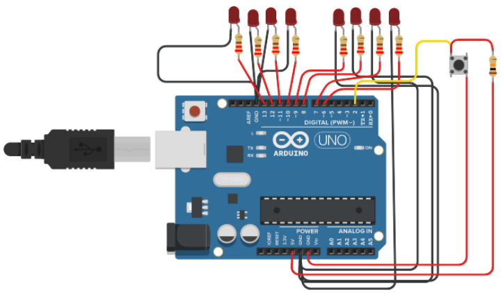
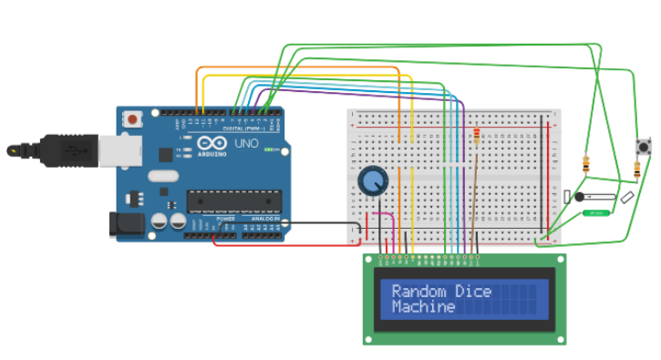

# GSoC 2019 Prerequisites

Project Name : Low-Power Interrupt-Based Drivers in Céu-Arduino  

The following project requires four tasks to be completed before the start of GSoC application period

## Tasks Completed
### Task 1 : Installing Ceu and Ceu-Arduino
Ceu-Arduino was succesfully set-up in an fresh Ubuntu 16.04 LTS VM and the examples were tested and run on an Arduino Uno.  

### Task 2 : Create a Ceu-Arduino Example using any Sensor or Actuator

The example made using Ceu-Arduino is a Packed-BCD Counter using LEDS. The output contains 8 LEDs, where the first 4 LEDs are for the 1st BCD number, while the second 4 bits are for the second BCD number. It requires use of a button as an input at PIN_2 and uses a vectored boolean variable to store four states for each digit. To show the example below :  

If the counter number is 29:  
First 4 LEDs = 1001 (9 in Binary)  
Second 4 LEDs = 0010 (2 in Binary)  
  
Hence the output will be 00101001.

### Task 3 : Create a simple example in C that uses interrupt-driven analog reads

The example written in C is an Electronic dice built around a SW2000 Tilt Sensor (with only ON and OFF). When we shake the dice, the SW2000 will send RISING pulse to arduino and will generate a random number. It is connected directly to INT0 (digital Pin 2). It also has an option to choose multiple dice modes:  

Mode 0 : Regular Die with output varying from 1 to 6  
Mode 1 : 2 Regular dice with outputs from (1,1) to (6,6) having 36 outputs  
Mode 2 : Randomly Generate a letter between T,D and S. (For party games like Truth/Dare/Situation)  

The Mode can be changed using a button attached to INT1 (digital pin 3). And LCD Screen is attached to show the output of each mode and dice output.

### Task 4 : Fork Céu-Arduino project on github and commit the new examples

The prerequisites have been committed to ceu-arduino/examples/Gsoc_Prerequisites folder  

