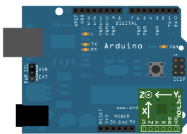

# GSoC 2019 Prerequisites

Project Name : Low-Power Interrupt-Based Drivers in Céu-Arduino  

The following project requires four tasks to be completed before the start of GSoC application period

## Tasks Completed
### Task 1 : Installing Ceu and Ceu-Arduino
Ceu-Arduino was succesfully set-up in an fresh Ubuntu 16.04 LTS VM and the examples were tested and run on an Arduino Uno.  

### Task 2 : Create a Ceu-Arduino Example using any Sensor or Actuator

The example made using Ceu-Arduino is a Packed-BCD Counter using LEDS. The output contains 8 LEDs, where the first 4 LEDs are for the 1st BCD number, while the second 4 bits are for the second BCD number. It requires use of a button as an input at PIN_2 and uses a vectored boolean variable to store four states for each digit. To show the example below :  

If the counter number is 29:  
First 4 LEDs = 1001 (9 in Binary)  
Second 4 LEDs = 0010 (2 in Binary)  
  
Hence the output will be 00101001.

### Task 3 : Create a simple example in C that uses interrupt-driven analog reads

The example written in C is a simple example of interfacing the ADXL33x series of Gyro-Sensor. The sensor contains 3 analog output pins, which are interfaced to analog pins A0,A1 and A2, and the values are constantly being read in a loop. The analog pins are selected by setting the last 4 bits of the ADMUX register to 0000, 0001 and 0010. By changing the value of ADMUX Lower 4 bits, we can work with other Analog input channels.

### Task 4 : Fork Céu-Arduino project on github and commit the new examples

The prerequisites have been committed to ceu-arduino/examples/Gsoc_Prerequisites folder  

